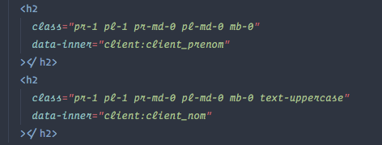

# hydrate()

Dynamically fills DOM elements with content and values by calling values stored in jSON format (also works on forms).

## Temporary English documentation
Hydrate.js has been developped as a simple helper function in a french-centric project. Translating this doc is on my to-do list. In the meantime, in case you would want to use it, here is a minimal documentation :

### Setup
1. declare an empty array called **sources** to store your jSON data.

        let sources = [];
        
        let myData = {
        	foo : 1,
        	bar : "baz"
        	}
        	
        // insert your object to sources
        sources.myData = myData

1. Link hydrate.js to you html then call it by adding this to the \<head> : 

        <script src="js/hydrate.js" defer></script>
        <script defer>hydrate()</script>

### Usage
1. Add a data-inner attribute to your target elements. Following the previous example  :

        <span data-inner="myData:baz"></span>
        <input type="number" data-inner="myData:foo"/>
        
<br><hr>


Permet de remplir dynamiquement des éléments du DOM en appelant la valeur voulue dans l'élément HTML (fonctionne notamment avec les champs de formulaires).

Les éléments sont remplis avec les valeurs stockées dans les jSON reçus du serveur. 

La fonction hydrate() remplit autant les inputs des formulaires que les div, spans, p...

|HTML|js|resultat|
|----|---|--------|
||||

##Utilisation

###Ø ARGUMENT  
la fonction n'accepte pas d'argument

### MISE EN PLACE POUR LE PROJET

Ces opérations ne sont à réaliser qu'une seule fois pour tout le projet.

1. Un array vide nommé **sources** doit être déclaré dans le projet.
Il sert à recueillir les différents jSON reçus après les requêtes au serveur. 

        let sources = [];

1. Appeler hydrate.js dans l'en-tête du html.```<script src="js/hydrate.js" defer></script>```. hydrate.js doit être appelé avant es appels aux fichiers js traitant on contenant les jSON.

1. La fonction doit être invoquée :

- soit une fois dans la partie commune du projet avec ```<script type="text/javascript">
hydrate()</script>``` juste avant la fermeture du body, ou avec ```<script type="text/javascript" defer>
hydrate()</script>``` dans l'en-tête du html.
- dans le fichier js se rapportant à la fonctionnalité, après la déclaration/obtention du jSON.


### MISE EN PLACE DANS UNE PAGE/FONCTIONNALITÉ
#### rendre les valeurs accessibles à la fonction hydrate()
hydrate() cherche les valeurs stockées dans un objet de type jSON qui soit se trouver dans l'array **"sources"** (qui est déjà déclaré au préalable dans le projet).

On ne préfixe pas la déclaration par let ou var, puisqu'on ajoute une entrée dans un array existant.

#####exemple :

```
sources.client = {
  client_id: 246,
  client_civilite: "other",
  client_nom: "Bidule",
  client_prenom: "Dominique",
  client_age: 33,
  client_code_beneficiaire: "2020775930G",
  client_mail: "dom.bidule@fake.com",
  client_tel: "06 01 23 45 67",
  client_compte_valide: false,
  nombre_paniers: 17,
  check: ["titi", "tutu"],
};
``` 

NOTE :  dans un jSON, les données sont présentées par paires séparées par des virgules. Chaque paire a deux membre, le premier est la clé, et le second sa valeur. [Plus d'infos pour les curieux.](https://developer.mozilla.org/fr/docs/Web/API/HTMLElement/dataset)

#### afficher la valeur d'une clé dans un élément HTML

Il suffit d'ajouter une propriété à l'élément en question.

```
<span data-inner="client:client_mail"></span>
```

NOTE : La propriété en question appartient au *dataset* de l'élément et on peut s'en servir et la manipuler avec du JS. [Plus d'infos pour les curieux.](https://developer.mozilla.org/fr/docs/Web/API/HTMLElement/dataset)

La propriété se découpe en deux parties, séparées par deux points :

1. **le nom du jSON** rangé dans l'array *"source"*,
2. **le nom de la clé** contenue dans ce jSON qu'on cherche à afficher.

En se basant sur le jSON définit précédemment, le span de l'exemple précédent contiendrait "**dom.bidule@fake.com**"